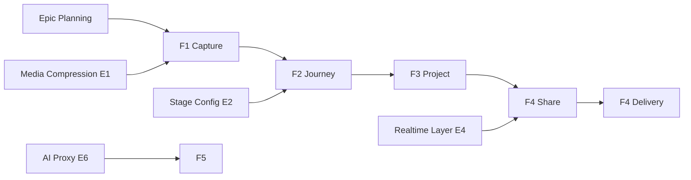

# Project Plan: Idea-to-Project Workflow (Spark / Neuidee)

> Generated with the `breakdown-plan` skill · App language: German (DE) · Tech: Vanilla JS PWA, localStorage-first, Supabase sync/realtime.

## 1. Project Overview

### Feature Summary
Neuidee ("Spark", ⚡) is a mobile-first, offline-first German PWA for capturing ideas and nurturing them into shipped projects. The core loop is: **capture a "Funke" (spark) → advance it through stages (Funke → Entwurf → Demo → Fertig) → convert it into a showcase project → share it with friends via realtime live chat.** This plan breaks the full product into an Agile work-item hierarchy so work can be tracked as GitHub issues.

### Success Criteria
- 100% of ideas can reach "Fertig" without data loss, offline and online.
- Idea → Project conversion keeps the source idea intact and linked both ways.
- Realtime share + live chat delivers notifications with no manual refresh (<2s).
- First-time users discover the stage swipe gesture (one-time hint shown).
- All UI strings are German; all screens work in a PWA install + mobile viewport.

### Key Milestones
| # | Milestone | Scope |
|---|-----------|-------|
| M1 | Core Capture & Journey | Idea CRUD, stages, timeline, swipe, search/filter |
| M2 | Project Showcase | Project form (+cover), status, progress, gallery, tags |
| M3 | Share & Realtime | Share center, nickname, notifications, live chat |
| M4 | AI Assistant | Prototype generator, AI chat, AI history |
| M5 | Profile & Polish | Heatmap, re-spark reminders, export/import, i18n |

### Risk Assessment
| Risk | Impact | Mitigation |
|------|--------|------------|
| localStorage full (base64 images) | High | Image compression (`DB.compressImage`, 900px/0.82), P0 |
| Realtime config drift on Supabase | High | `supabase_schema.sql` re-run documented + smoke test |
| AI key exposure in client | High | Move behind `/api/ai.js` Vercel proxy (already), rotate on leak |
| Swipe gesture vs vertical scroll conflicts | Medium | Axis-lock heuristic + one-time hint |
| Cross-device sync conflicts | Medium | Server-timestamp last-write-wins sync strategy |

## 2. Work Item Hierarchy

```mermaid
graph TD
    A[Epic: Idea-to-Project Workflow] --> B[F1: Idea Capture & Management]
    A --> C[F2: Idea Journey & Stages]
    A --> D[F3: Project Showcase]
    A --> E[F4: Share & Live Chat]
    A --> F[F5: AI Assistant]
    A --> G[F6: Profile & Activity]

    B --> B1[S1: Capture idea with text/tags/images]
    B --> B2[S2: Search, filter & sort ideas]
    B --> B3[S3: Soft-delete with undo]
    B --> E1[E: Media compression util]

    C --> C1[S4: Advance/back across stages]
    C --> C2[S5: Swipe gesture with one-time hint]
    C --> C3[S6: Timeline & history view]
    C --> E2[E: Stage config & state model]

    D --> D1[S7: Create project from idea]
    D --> D2[S8: Edit project (status, tags, link, cover)]
    D --> D3[S9: Project detail with progress bar]
    D --> E3[E: Cover upload + compression]

    E --> E4[S10: Share project with friend by nickname]
    E --> E5[S11: Notifications center + browser push]
    E --> E6[S12: Realtime live chat on project]
    E --> E5a[E4: Realtime subscription layer]
    E --> E6a[E5: Notification storage + badge]

    F --> F1a[S13: UI prototype generator]
    F --> F2a[S14: AI chat per idea]
    F --> E6b[E6: AI proxy endpoint + key handling]

    G --> G1[S15: Activity heatmap]
    G --> G2[S16: Re-spark reminders]
    G --> G3[S17: Export / import data]
    G --> G4[S18: German i18n across screens]

    C1 --> T1[Test: Stage transition unit tests]
    D1 --> T2[Test: Conversion keeps idea + link]
    E5 --> T3[Test: Realtime notification end-to-end]
```

## 3. GitHub Issues Breakdown

### Epic Issue Template

```markdown
# Epic: Idea-to-Project Workflow

## Epic Description
The core product loop of Neuidee: capture ideas, advance them through stages,
convert them into showcase projects, and share them via realtime live chat —
all offline-first with Supabase sync.

## Business Value
- **Primary Goal**: Turn fleeting ideas into finished, shareable projects.
- **Success Metrics**: ideas → projects conversion rate; time-to-Fertig; active shares.
- **User Impact**: One continuous, gamified journey from "Funke" to "Fertig".

## Epic Acceptance Criteria
- [ ] Ideas survive offline edits and sync on reconnect.
- [ ] Idea → project conversion preserves the source idea (no auto-archive).
- [ ] Share + live chat works realtime across two devices.
- [ ] Whole UI is German and PWA-installable.

## Features in this Epic
- [ ] #F1 - Idea Capture & Management
- [ ] #F2 - Idea Journey & Stages
- [ ] #F3 - Project Showcase
- [ ] #F4 - Share & Live Chat
- [ ] #F5 - AI Assistant
- [ ] #F6 - Profile & Activity

## Definition of Done
- [ ] All feature stories completed
- [ ] End-to-end testing passed
- [ ] Performance benchmarks met
- [ ] Documentation updated
- [ ] User acceptance testing completed

## Labels
`epic`, `priority-high`, `value-high`

## Milestone
Release 1.0 (PWA launch)

## Estimate
XL
```

### Feature Issue Template (F3 · Project Showcase)

```markdown
# Feature: Project Showcase

## Feature Description
Convert ideas into showcase projects with a cover image, status, tags, link and
progress bar. Projects appear on the Journey screen and can be opened in a
detail sheet with a live section.

## User Stories in this Feature
- [ ] #S7 - Create project from idea
- [ ] #S8 - Edit project (status, tags, link, cover)
- [ ] #S9 - Project detail with progress bar

## Technical Enablers
- [ ] #E3 - Cover upload + compression

## Dependencies
**Blocked by**: #E1 (media compression util)
**Blocks**: #F4 (Share & Live Chat needs a project to share)

## Acceptance Criteria
- [ ] Creating a project from an idea keeps the idea + links `projectId` both ways
- [ ] Newly created project opens its detail sheet automatically
- [ ] Cover can be uploaded, previewed, and removed
- [ ] Status chips persist across reopen

## Definition of Done
- [ ] All user stories delivered
- [ ] Technical enablers completed
- [ ] Integration testing passed
- [ ] UX review approved

## Labels
`feature`, `priority-high`, `value-high`, `projects`

## Epic
#Epic1

## Estimate
M
```

### User Story Issue Template (S5 · Swipe Gesture with Hint)

```markdown
# User Story: Swipe Gesture with One-Time Hint

## Story Statement
As a **mobile user**, I want to **swipe an idea card left/right to archive or
advance** so that **I can move ideas fast without opening them**, and I want a
one-time hint so I discover the gesture.

## Acceptance Criteria
- [ ] Swipe right (>72px) advances to next stage with confetti + toast
- [ ] Swipe left archives with undo option
- [ ] Vertical scroll intent is not confused with horizontal swipe
- [ ] Hint banner shows once (localStorage `spark_swipe_hint_seen`), dismissible
- [ ] Swiping hides the hint permanently

## Technical Tasks
- [ ] #T - Pointer-event swipe binding in `App.bindSwipe`
- [ ] #T - Hint banner markup + dismiss logic

## Testing Requirements
- [ ] #T - Pointer/scroll conflict regression test

## Dependencies
**Blocked by**: #E2 (stage config & state model)

## Definition of Done
- [ ] Acceptance criteria met
- [ ] Code review approved
- [ ] Works on touch + mouse

## Labels
`user-story`, `priority-medium`, `frontend`, `ideas`

## Feature
#F2

## Estimate
2
```

### Technical Enabler Issue Template (E1 · Media Compression)

```markdown
# Technical Enabler: Media Compression

## Enabler Description
Single source of truth for downscaling and compressing images before storing
as base64 in localStorage, used by idea capture and project cover upload.

## Technical Requirements
- [ ] Downscale to max 900px, quality 0.82 (canvas-based)
- [ ] Graceful failure → user toast, no state corruption
- [ ] EXIF orientation preserved

## Implementation Tasks
- [ ] #T - Implement `DB.compressImage(file, maxW, quality)`
- [ ] #T - Wire into capture modal + project cover

## User Stories Enabled
- #S1 - Capture idea with text/tags/images
- #S8 - Edit project (status, tags, link, cover)

## Acceptance Criteria
- [ ] 5MP photo → <500KB base64
- [ ] No crash on invalid/corrupt files

## Definition of Done
- [ ] Implementation completed
- [ ] Unit tests written
- [ ] Documentation updated
- [ ] Code review approved

## Labels
`enabler`, `priority-high`, `infrastructure`, `media`

## Feature
#F1

## Estimate
3
```

## 4. Priority and Value Matrix

| Priority | Value  | Work Items (proposed)                              | Labels |
| -------- | ------ | -------------------------------------------------- | ------ |
| P0       | High   | #E1 Media compression · #F4 Share realtime sync    | `priority-critical`, `value-high` |
| P1       | High   | #S1 capture · #S4 stages · #S7/#S8 project · #S10 share · #S11 notifications · #S13/#S14 AI | `priority-high`, `value-high` |
| P1       | Medium | #S2 search/filter · #S3 soft-delete · #S5 swipe · #S6 timeline | `priority-high`, `value-medium` |
| P2       | Medium | #S9 progress bar · #S12 live chat · #S15 heatmap · #S16 re-spark | `priority-medium`, `value-medium` |
| P3       | Low    | #S17 export/import · #S18 i18n polish · tech debt  | `priority-low`, `value-low` |

## 5. Estimation Guidelines

- **1 pt**: copy change, button label
- **2 pts**: small feature (swipe hint, soft-delete undo)
- **3 pts**: medium (capture modal, timeline, notifications center)
- **5 pts**: large (share center + realtime, AI prototype generator)
- **8 pts**: complex (realtime live chat, sync engine)
- **T-shirt (features)**: F1 M · F2 M · F3 M · F4 L · F5 L · F6 S

## 6. Dependency Management



| Dependency | Type | Note |
|-----------|------|------|
| E1 → F1, F3 | Prerequisite | Compression used by capture + cover |
| E2 → F2 | Prerequisite | Stage order shared across views |
| E4 (realtime) → F4 | Prerequisite | Requires `shares` in Supabase realtime publication |
| F3 → F4 | Blocks | Share needs an existing project |
| E6 (AI proxy) → F5 | Prerequisite | Keep key off the client |

## 7. Sprint Planning Template

### Sprint Capacity Planning
- **Team Velocity**: 5 pts/sprint (solo dev)
- **Sprint Duration**: 1 week
- **Buffer Allocation**: 20% for bug fixes
- **Focus Factor**: 80%

### Sprint Goal Example

```markdown
## Sprint 1 Goal
**Primary Objective**: Solid capture + journey foundation
**Stories in Sprint**: #S1 (3) · #S4 (2) · #S5 (2) · #E1 (3)
**Total Commitment**: 10 pts (≈80% of 12-pt capacity with buffer)
**Success Criteria**: Idea can be created, advanced, swiped, and reopened.
```

## 8. GitHub Project Board Configuration

### Column Structure (Kanban)
1. **Backlog** → 2. **Sprint Ready** → 3. **In Progress** → 4. **In Review** → 5. **Testing** → 6. **Done**

### Custom Fields
- **Priority**: P0–P3 · **Value**: High/Med/Low
- **Component**: Frontend / Backend(API) / Infrastructure / Testing
- **Estimate**: Fibonacci points / t-shirt
- **Sprint**, **Assignee**, **Epic**

## 9. Automation and GitHub Actions

### Automated Status Updates

```yaml
name: Update Issue Status
on:
  pull_request:
    types: [opened, closed]
jobs:
  update-status:
    runs-on: ubuntu-latest
    steps:
      - name: Move to In Review
        if: github.event.action == 'opened'
        uses: actions/github-script@v7
        with:
          script: |
            const ref = context.payload.pull_request.head.ref;
            const issue = ref.match(/(?:^|\/)(\d+)/)?.[1];
            if (issue) {
              await github.rest.projects.createCard({ ... /* "In Review" */ });
            }
      - name: Move to Done
        if: github.event.action == 'closed' && github.event.pull_request.merged
        uses: actions/github-script@v7
        with:
          script: |
            /* move linked issue card to "Done" */
```

## Issue Creation Checklist

### Pre-Creation Preparation
- [x] Feature artifacts reviewed (DESIGN.md, codebase, this plan)
- [ ] Epic issue created with labels + milestone
- [ ] Project board configured (columns, custom fields)

### Epic Level Issues
- [ ] Epic issue created with description + acceptance criteria
- [ ] Epic milestone created (Release 1.0)
- [ ] Epic labels applied: `epic`, `priority-high`, `value-high`

### Feature Level Issues (6)
- [ ] #F1 Idea Capture & Management — M — `feature`
- [ ] #F2 Idea Journey & Stages — M — `feature`
- [ ] #F3 Project Showcase — M — `feature`
- [ ] #F4 Share & Live Chat — L — `feature`
- [ ] #F5 AI Assistant — L — `feature`
- [ ] #F6 Profile & Activity — S — `feature`

### Story/Enabler Level Issues
Full story/enabler/test checklist in `issues-checklist.md`.

## Success Metrics

### Project Management KPIs
- **Sprint Predictability**: >80% committed pts completed per sprint
- **Cycle Time**: "In Progress" → "Done" <5 business days
- **Defect Escape Rate**: <5% of stories need post-release fixes

### Process Efficiency Metrics
- **Issue Creation Time**: <1 hour for full breakdown (this plan)
- **Status Update Accuracy**: >95% automated transitions

### Project Delivery Metrics
- **Definition of Done Compliance**: 100% of completed stories meet DoD
- **Acceptance Criteria Coverage**: 100% validated
- **Sprint Goal Achievement**: >90%
